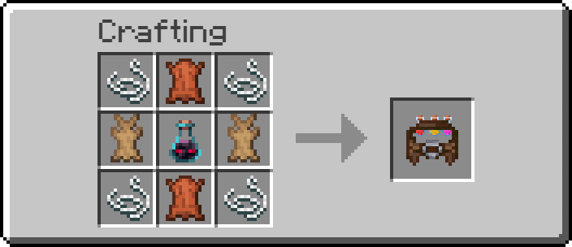

# Main Screen and HUD

## The belt item

Craft or obtain a Potion's Belt item. It has 27 slots (3 rows x 9 columns)
and only accepts:
- Drinkable (non-splash, non-lingering) potions.
- Empty glass bottles (so you can pre-load bottles, or just so drunk
  potions have somewhere to sit).

Like a shulker box, a Potion's Belt occupies exactly **one inventory slot
per belt**, no matter how full it is — it doesn't stack with other belts
(unlike ordinary items, which stack up to 64), since each one carries its
own independent 27-slot inventory as item data.

---

## Crafting

| | | |
|---|---|---|
| String | Leather | String |
| Rabbit Hide | Ominous Bottle | Rabbit Hide |
| String | Leather | String |

Result: 1 Potion's Belt.

The **Ominous Bottle** (looted from an Ominous Vault in a Trial Chamber) is
a deliberate gate: a dedicated 27-slot potion container with instant,
column-based drinking is a real capacity/convenience upgrade, so it costs
more than fully renewable, zero-effort materials — similar to how a
shulker box costs shulker shells, not just planks.

It's also a deliberate thematic fit, not just a convenient rare item: the
Ominous Bottle is itself a bottle carrying a potent effect (Bad Omen), the
same category of thing the belt is purpose-built to hold and dispense.
Normally you'd drink it to trigger an Ominous Trial (or a raid); crafting a
belt spends that same bottle on a different kind of "potent effect" instead
— permanent, personal mastery over how you carry and drink potions, rather
than a one-off encounter.

> [!NOTE]
> Crafting a belt spends the Ominous Bottle outright — it doesn't get
> returned, and you trade away its usual vanilla use (drinking it to
> re-trigger Bad Omen for another Ominous Vault).

---

## Opening the belt's GUI

Two ways, both open the same 27-slot screen (reuses the vanilla shulker
box layout):
- Press <kbd>E</kbd> (the vanilla "Open/Close Inventory" key) while the
  belt is in your **main hand**.
- Press the dedicated "Open Belt Menu" keybind (unbound by default — see
  [Column Loadouts & Keybinds](Column-Loadouts.md) to set it up), which
  works from either hand.

Inside, drag potions and bottles in and out like any other container.
Anything that isn't a drinkable potion or an empty bottle is rejected,
including on shift-click.

You can pick up, drop, or drag the belt around your inventory normally
even while its own menu is open — nothing is locked.

---

## Drinking

**Right click** with the belt in either hand to drink — it uses the same
1.6-second animation as drinking a potion normally, so it doesn't change
game balance. Which potion gets drunk depends on your current column
selection; see [Column Loadouts](Column-Loadouts.md).

If the belt has no potions at all (only bottles, or completely empty),
right click does nothing but show a message and play a short sound —
no animation plays.

---

## The HUD preview

Whenever the belt is held in either hand, a small icon plus the potion's
name appears next to the hotbar (mirroring the position of vanilla's
offhand-item indicator, on the opposite side). It always shows exactly
which potion *would* be drunk right now, so you never have to guess before
committing to the 1.6-second animation.

---

## Sounds

- A leather-belt sound plays whenever the GUI opens (either entry point).
- A distinct "bottle opens" sound plays right before the drink animation
  starts.
- A "bottle closes" sound plays when a drink ends — whether it finished
  normally, was released early, or was interrupted (switching hotbar slot,
  picking an empty column mid-drink, etc.).
